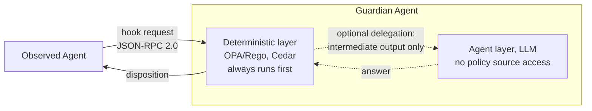
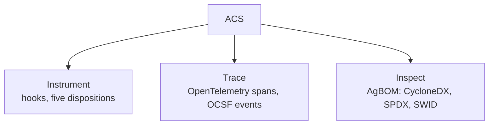
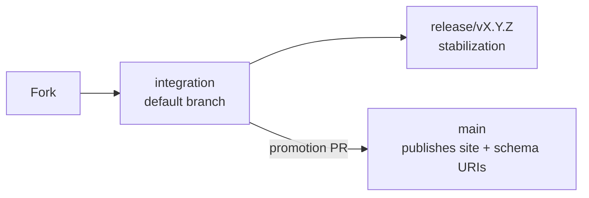
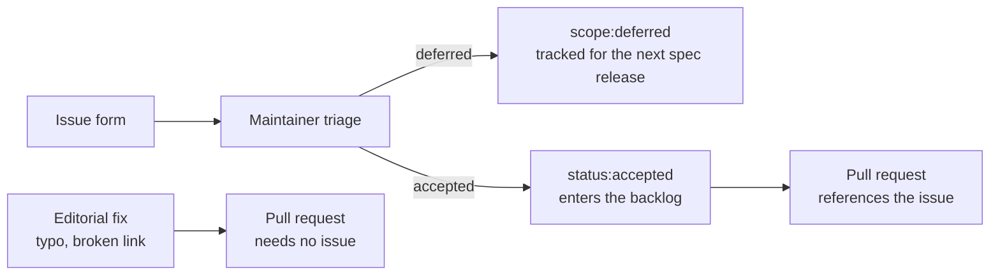

# Agent Control Standard

[](./LICENSE)
[](./LICENSE-DOCS)


ACS is a wire specification. It lets a separate Guardian Agent inspect what an AI agent
is about to do and permit, deny, or modify that action before it happens, over an
authenticated channel, with an audit trail that reconstructs after the fact.

## A hook, on the wire

An agent that implements ACS sends a hook request before it acts. Here an agent asks
to read a file, and the Guardian says yes.

```json
{
  "jsonrpc": "2.0",
  "method": "steps/toolCallRequest",
  "id": "1",
  "params": {
    "acs_version": "0.1.0",
    "request_id": "b3e1c9f0-3b21-4b7a-9f2e-6a6d2e6a9a11",
    "timestamp": "2026-09-09T14:02:11Z",
    "metadata": {
      "agent_id": "research-assistant",
      "session_id": "5b7a6e2a-6a2e-4b7a-9f2e-6a6d2e6a9a22"
    },
    "payload": {
      "tool": { "name": "file_read" },
      "arguments": { "path": { "value": "/reports/q3-summary.md" } }
    }
  }
}
```

The Guardian's answer:

```json
{
  "jsonrpc": "2.0",
  "id": "1",
  "result": {
    "type": "final",
    "acs_version": "0.1.0",
    "request_id": "b3e1c9f0-3b21-4b7a-9f2e-6a6d2e6a9a11",
    "decision": "allow"
  }
}
```

Both payloads validate against the schemas in this repository, `request-envelope.json`,
`hooks/tool-call-request.json`, and `response-envelope.json`. Nothing here is invented.

## Fetch a schema

Every schema in ACS v0.1.0 lives at the URL its own `$id` names. The `$id` is not a
label sitting beside the real address. It is the identity and the published location at
once, which is why a `$ref` inside one schema can resolve against the same base every
other schema in the set uses.

```bash
curl -s https://genai-security-project.github.io/agent-control-standard/schema/v0.1.0/hooks/tool-call-request.json
```

That fetches the schema behind the `toolCallRequest` payload above, published from
`specification/v0.1.0/hooks/tool-call-request.json` in this repository. All 44 schemas
resolve the same way, each under the `v0.1.0` namespace shown in that URL. A merge to
`main` republishes the full set, and the build fails before it ships if any `$id`
collides or any `$ref` fails to resolve. A separate check reruns every six hours and
confirms all 44 URIs still answer.

## A policy that edits instead of blocking

Not every verdict is a plain yes. Here the agent asks to run an unbounded query, and the
Guardian returns `modify` instead of `allow` or `deny`, rewriting the argument before
the tool ever runs.

```json
{
  "jsonrpc": "2.0",
  "method": "steps/toolCallRequest",
  "id": "2",
  "params": {
    "acs_version": "0.1.0",
    "request_id": "c4f2d0a1-4c32-4c8b-a03f-7b7e3f7b0b33",
    "timestamp": "2026-09-09T14:03:47Z",
    "metadata": {
      "agent_id": "research-assistant",
      "session_id": "5b7a6e2a-6a2e-4b7a-9f2e-6a6d2e6a9a22"
    },
    "payload": {
      "tool": { "name": "database_query" },
      "arguments": { "query": { "value": "SELECT * FROM customers" } }
    }
  }
}
```

```json
{
  "jsonrpc": "2.0",
  "id": "2",
  "result": {
    "type": "final",
    "acs_version": "0.1.0",
    "request_id": "c4f2d0a1-4c32-4c8b-a03f-7b7e3f7b0b33",
    "decision": "modify",
    "reasoning": "Unbounded SELECT against customers exceeds the row-limit policy. Query capped at 100 rows.",
    "modifications": {
      "parameter_overrides": {
        "query": "SELECT id, name FROM customers LIMIT 100"
      }
    }
  }
}
```

This verdict came from the Guardian's deterministic layer alone, an engine like
OPA/Rego or Cedar evaluating a written policy against the request. The deterministic
layer always runs first. A chain config MAY delegate to a second, agent layer, an LLM,
when the deterministic layer cannot resolve the request on its own, but that LLM never
reads the policy source. It receives only the intermediate output the deterministic
layer chooses to hand over, and its answer still has to clear the deterministic layer on
the way back out. Deterministic-only deployments are fully conformant. Delegation is
optional.



## Concepts

Two parties speak ACS. The **Observed Agent** is the LLM-backed system being watched,
the one sending hook requests like the ones above. The **Guardian Agent** sits on the
other end of the wire and decides what happens next.

A **hook** is a point in the Observed Agent's execution where it stops and asks before
acting. `toolCallRequest` is one of ACS's sixteen native lifecycle hooks. Others fire at
session start and end, before and after a turn, on knowledge retrieval, and around
memory reads and writes.

The Guardian answers every hook with one of five **dispositions**: `allow`, `deny`,
`modify`, `ask` (route to a human, agent, or service approver), or `defer` (postpone the
verdict when the Guardian cannot yet reach one). The two examples above showed `allow`
and `modify`.

ACS organizes its requirements into three pillars. **Instrument** is the hook and
disposition machinery already shown. **Trace** records every hook and every decision as
an OpenTelemetry span and an OCSF event, so a security team's existing tooling reads an
ACS audit trail without new plumbing. **Inspect** produces the AgBOM, a live inventory of
an agent's models, tools, and dependencies, serialized as CycloneDX, SPDX, or SWID on
request.



A deployment does not have to implement all three to conform. **ACS-Core**, the
Instrument pillar plus the wire format and the audit chain, is the mandatory baseline.
Trace, Inspect, field-level Provenance, and cryptographic signing are **conformance
profiles** that a deployment declares at the handshake and adds independently.

A reader who only wants to know whether ACS fits their problem can stop here.

## Contributing right now

Governance changed for the OWASP relaunch, and it matters starting today.
`CONTRIBUTING.md` now names one filter for what the project accepts: the **Current
Priority Scope**, the section at the top of that file. It states the project's one
committed outcome for the current window, then sorts every possible contribution into
in focus, deferred to the next specification release, or out of scope by design. Read it
before opening an issue. Everything below assumes you have.

Pull requests fork from and target `integration`, the default branch. `main` takes only
two kinds of change: a promotion pull request from `integration`, and an editorial fix
to a file on a short allowlist, this one included. `release/*` branches stabilize a
specification version between `integration` and a tag. Merging to `main` is what
republishes the site and every schema `$id` under it, which is why specification and
code changes go through `integration` first.



Every issue starts from one of six forms. There are no blank issues. A form applies a
`type:` label and `status:needs-triage` automatically, and nothing else. Only a
maintainer can move an issue to `status:accepted`, and only an accepted issue enters the
backlog. A pull request that changes behavior, alters normative text, or adds code
references an accepted issue. An editorial correction, a typo or a broken link, needs
none.



`CONTRIBUTING.md` is the authority on the full scope list, the branch names, the label
taxonomy, and the sign-off every commit needs. Start there, not here.

## What's next

Specification v0.1.0 ships today. The tagged release is v0.1.1. The next specification
release, v0.2.0, targets March 2027. A v1.0 date has not been set.

The near term runs against four GitHub milestones: Day 14 (September 24), Day 30
(October 9), Day 60 (November 6), and Day 90 (December 4, 2026). Each carries the
project's committed outcome as its description. What is in focus for the current window
lives in one place, the Current Priority Scope in
[CONTRIBUTING.md](./CONTRIBUTING.md), reviewed at every milestone so it never drifts
from what that section says.

## Where to go next

- [Documentation site](https://genai-security-project.github.io/agent-control-standard/docs/): the specification, concepts, and topic guides.
- [Specification](https://github.com/GenAI-Security-Project/agent-control-standard/tree/main/specification): the JSON Schemas and normative prose in this repository.
- [GitHub Discussions](https://github.com/GenAI-Security-Project/agent-control-standard/discussions): questions and design conversation.
- Slack: [owasp.slack.com](https://owasp.slack.com), channel `#team-genai-asi-acs-general`.
- [CONTRIBUTING.md](./CONTRIBUTING.md): how work gets accepted.
- [SECURITY.md](./SECURITY.md): how to report a vulnerability.
- [GOVERNANCE.md](./GOVERNANCE.md): who leads which workstream.
- [Project board](https://github.com/orgs/GenAI-Security-Project/projects/9): tracked work across the milestones above.

## About

ACS is an open project of the [OWASP GenAI Security Project](https://genai.owasp.org/), open to contributions from the community.

Code and schemas are licensed under the [Apache License 2.0](./LICENSE). Documentation is licensed under [CC BY-SA 4.0](./LICENSE-DOCS). See [LICENSING.md](./LICENSING.md) for the scope map.
