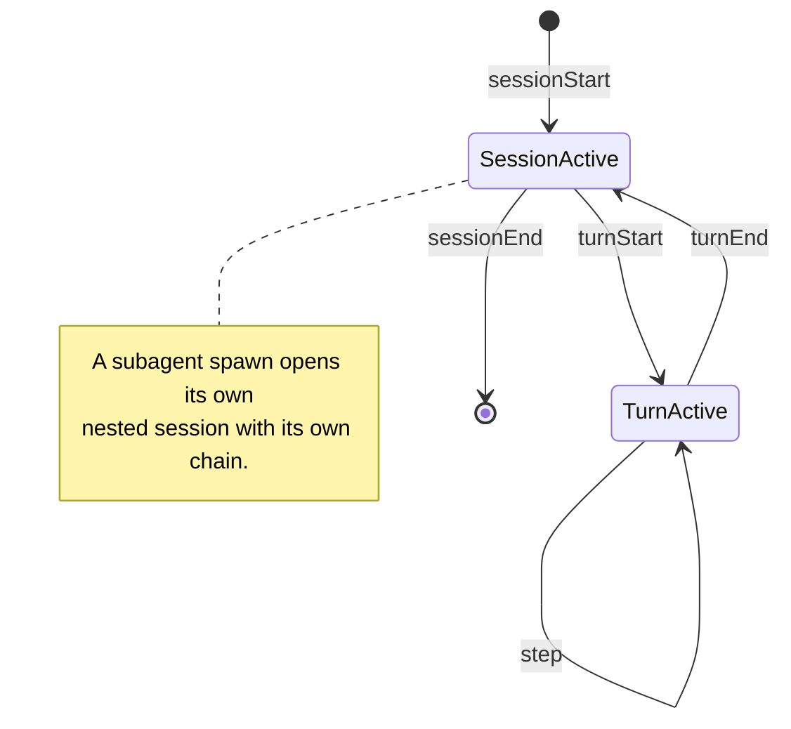

# Session lifecycle

ACS scopes everything it observes to a session, and within a session to turns and steps. Subagents nest sessions. These boundaries are what make the audit chain reconstructable.

## Session

The scoped unit of interaction, from activation to completion, identified by a `session_id`. A session opens the SessionContext audit chain: the first entry has `previous_hash: null`, and every subsequent entry links to the one before it, so the session's security-relevant history is tamper-evident.

A session is normally opened by `sessionStart`, which is also where session-level identity, policy selection, and Intent are attached before any content enters.

## Turn

A turn is one cycle of agent activity within a session, bounded by `turnStart` and `turnEnd`. A turn is opened by a trigger (a user message, an auto-continuation, an agent's own planning loop, a subagent return, or a non-user event) and ends in a terminal status such as completed, deferred, error, or interrupted.

## Step

A step is an atomic action or decision within the agent's reasoning process. Steps are the unit the Instrument hooks fire on (`steps/*`), and each decision-eligible step is where a Guardian may intervene.

## Subagent

When a parent agent spawns a subagent in the same runtime, the spawn is observed through `subagentStart`. Each subagent gets its own `session_id` and its own SessionContext; the parent–child relation is recorded.

> **Intent derivation is auditable (normative).** When a subagent is spawned, the audit chain MUST record how the subagent's `Intent.parsed` relates to the parent's: inherited in full, a strict subset, derived from a parent directive, or fresh. A Guardian MAY deny a spawn whose derivation would grant capabilities the parent's [Intent](./intent.md) does not authorize.

*Example.* A research agent spawns a summarizer subagent with `inherit_subset`: the child may read files but not write them. A Guardian that sees a write capability in the child's derived intent can deny the spawn.

Delegation that crosses an A2A boundary is not a subagent spawn; it flows through `agentTrigger` and is reserved for v0.2.

The diagram below shows how a session moves through turns and steps until it ends.

---

**Referenced by**

- **Instrument**, [specification](../spec/instrument/specification.md): SessionContext chain (§8), the `steps/*` hooks, session/turn/subagent lifecycle hooks; [hooks](../spec/instrument/hooks.md).
- **Trace**, [events](../spec/trace/events.md): session start/end map to OCSF Authentication logon/logoff; subagent spawn opens a nested session.
- **Inspect**, [AgBOM](../spec/inspect/README.md): the snapshot is emitted once per session before content-bearing hooks fire.
- See also [Intent](./intent.md) and [Trust basis](./trust.md) (the chain hash is an attested rung).
