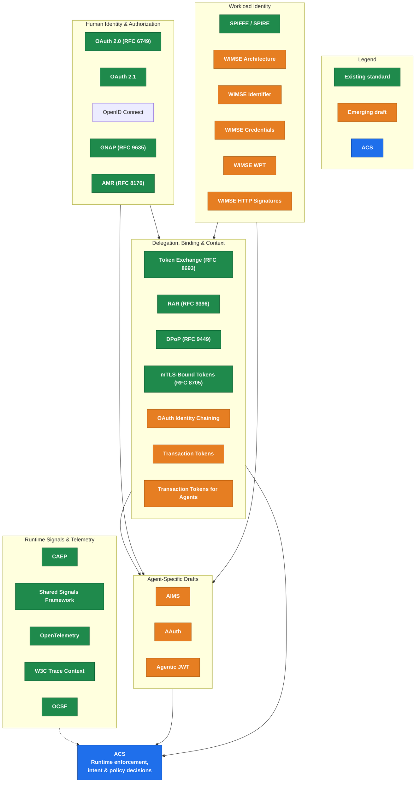

# Related and Emerging Standards

This page is the single source of truth for the identity, authentication, authorization, delegation, workload identity, and observability standards that **ACS** composes with, and for the specific gaps in those standards that ACS is designed to fill.

> **ACS does not replace these standards.**
> ACS does not recommend one implementation over another.
> ACS does not redefine token formats, credential formats, grant flows, workload identifiers, or authentication protocols.

Instead, ACS builds upon existing work from the **IETF**, **OpenID Foundation**, **SPIFFE / WIMSE community**, **OpenTelemetry**, **OCSF**, and other standards bodies, adding the runtime enforcement layer those standards intentionally do not define.

The goal is simple:

> **One place where builders can understand the identity landscape for agentic systems, and where ACS fits into it.**

This page intentionally includes:

- **Mature standards** already deployed in production (OAuth 2.0, OIDC, SPIFFE, the foundational RFCs)
- **Emerging standards and drafts** being developed specifically for agent ecosystems (AIMS, WIMSE, Transaction Tokens, AAuth, Agentic JWT)
- **The gaps** in both that ACS exists to address

## At a Glance

The diagram below frames how the standards on this page relate to each other and to ACS.

---

## Existing Standards

The following standards are broadly adopted and form the foundation of modern identity systems.

| Standard | Description | Link |
|---|---|---|
| **OAuth 2.0 (RFC 6749)** | The original delegated authorization framework. Defines authorization code, client credentials, and other grants. Foundational, but designed for **registered, deterministic web/native clients**. See [Why OAuth 2.0 Alone Doesn't Meet Agent Needs](#why-oauth-20-alone-doesnt-meet-agent-needs) below. | [RFC 6749](https://datatracker.ietf.org/doc/rfc6749/) |
| **OAuth 2.1** | In-progress consolidation of OAuth 2.0 and later security best practices for delegated authorization. | [oauth.net/2.1](https://oauth.net/2.1/) |
| **OpenID Connect (OIDC)** | Authentication layer built on OAuth that establishes human identity. | [openid.net](https://openid.net/developers/how-connect-works/) |
| **SPIFFE / SPIRE** | Cryptographically verifiable workload identity for machines and services. A conformant implementation of the WIMSE identifier model. | [spiffe.io](https://spiffe.io/) |
| **RFC 8693, Token Exchange** | Exchange one identity token for another with reduced scope and delegated authority. Single-hop by design; multi-hop chain semantics are **underspecified** and are being addressed by [OAuth Identity Chaining](#delegation-chains-transaction-context) and emerging agent-delegation drafts. | [RFC 8693](https://datatracker.ietf.org/doc/rfc8693/) |
| **RFC 9396, Rich Authorization Requests (RAR)** | Fine-grained, structured authorization requests beyond traditional OAuth scopes. **Required by ACS** for non-trivial agent actions. | [RFC 9396](https://datatracker.ietf.org/doc/rfc9396/) |
| **RFC 9449, DPoP** | Sender-constrained access tokens that reduce token theft and replay attacks. Required by AIMS and ACS for agent contexts. | [RFC 9449](https://datatracker.ietf.org/doc/rfc9449/) |
| **RFC 8705, mTLS Certificate-Bound Tokens** | Binds access tokens to client certificates for workload-to-workload authentication. | [RFC 8705](https://datatracker.ietf.org/doc/rfc8705/) |
| **RFC 8176, AMR** | Standardized representation of authentication strength and methods. | [RFC 8176](https://datatracker.ietf.org/doc/rfc8176/) |
| **GNAP (RFC 9635)** | Modern authorization protocol supporting interactive and delegated authorization flows. | [RFC 9635](https://datatracker.ietf.org/doc/rfc9635/) |
| **OpenID CIBA** | Client-Initiated Backchannel Authentication for out-of-band human approval. Used by AIMS for human-in-the-loop, but does **not** natively support mid-execution re-authorization (see [§ Why OAuth 2.0 Alone Doesn't Meet Agent Needs](#why-oauth-20-alone-doesnt-meet-agent-needs)). | [CIBA Core](https://openid.net/specs/openid-client-initiated-backchannel-authentication-core-1_0.html) |
| **CAEP** | Continuous Access Evaluation Profile for near real-time session revocation and risk signaling. | [CAEP 1.0](https://openid.net/specs/openid-caep-specification-1_0.html) |
| **OpenID Shared Signals Framework (SSF)** | Standardized risk, security, and session-change event sharing between systems. Adopted by AIMS as the eventing transport. | [Shared Signals WG](https://openid.net/wg/sharedsignals/) |
| **W3C Trace Context** | Standardized trace propagation across distributed systems. | [W3C Trace Context](https://www.w3.org/TR/trace-context/) |
| **OpenTelemetry** | Open standard for distributed tracing, metrics, and observability. | [opentelemetry.io](https://opentelemetry.io/) |
| **OCSF** | Open Cybersecurity Schema Framework for normalized security telemetry. | [schema.ocsf.io](https://schema.ocsf.io/) |

### What These Standards Solve

Collectively, the mature standards above answer foundational identity questions:

- **Who** is the actor?
- **How** does the actor authenticate?
- **How** are credentials issued?
- **How** is delegated authority represented (single-hop)?
- **How** are workloads identified?
- **How** is request context propagated?
- **How** is trust transferred across systems?

### What These Standards Do **Not** Solve

These standards establish **trust**. They do not determine whether an action **should** happen, and several were not designed with autonomous, non-deterministic agents in mind.

They do not:

- Evaluate intent
- Detect prompt injection or memory poisoning
- Decide whether delegated authority remains appropriate after runtime reasoning changes course
- Verify multi-hop delegation chain integrity end-to-end
- Specify failure-mode behavior when the IdP is unreachable

> Those questions belong to **ACS**.

---

## Why OAuth 2.0 Alone Doesn't Meet Agent Needs

OAuth 2.0 is the foundation, but its design assumptions break for autonomous agents. The drafts under [Emerging Agent Identity Standards](#emerging-agent-identity-standards) (AIMS, AAuth, Agentic JWT, Transaction Tokens for Agents, and OAuth Identity Chaining) exist precisely because of these gaps. ACS addresses the **runtime** subset.

| OAuth 2.0 Assumption | How Agents Break It | What Addresses It |
|---|---|---|
| **The client is a stable, registered software identity** with approximately constant behavior. | An agent's execution path is composed at runtime by a non-deterministic model over inputs that may include adversarial content (indirect prompt injection). A registered client with valid credentials can have its reasoning hijacked. OAuth client auth cannot distinguish "authenticated and behaving" from "authenticated and hijacked." | **ACS runtime enforcement.** No token-issuance standard can patch this; it requires inline behavioral verification at action time. |
| **Delegation is single-hop** (`user → client → resource server`). | Agent chains are `user → orchestrator → sub-agent → tool → API`. RFC 8693 Token Exchange retrofits multi-hop but leaves chain verification, mandatory scope attenuation, and revocation propagation unspecified. A **delegation chain splicing vulnerability** was disclosed on the OAuth WG list in February 2026. | OAuth Identity Chaining draft; AIMS §10.5; **ACS delegation-integrity checks** at every hop. |
| **Consent is grant-time, not action-time.** Approve scope once, client holds token until revoked. | Agents need consent that is **fresh** (user still present) and **granular** (this specific action, not just this scope). CAEP adds freshness signals; CIBA adds step-up, but **CIBA only covers client initiation**, not mid-execution re-authorization. AIMS §10.6 names this gap explicitly. | **ACS mid-execution step-up** and intent-aligned policy checks. |
| **Scopes are pre-declared static strings** (`read`, `write`, `repo`). | Static scopes can't express per-action, per-resource, per-data-cell intent that agents operate at. | **RFC 9396 (RAR)**, required by ACS for non-trivial scopes. |
| **Bearer tokens.** Possession is sufficient for use. | Agent memory, tool outputs, logs, and crash dumps are all token-leak surfaces. Prompt injection can exfiltrate tokens from working memory. | **DPoP (RFC 9449)** and **mTLS-bound tokens (RFC 8705)**, required by both AIMS and ACS. |
| **Access tokens can live for an hour.** [RFC 6749 §4.2.2](https://www.rfc-editor.org/rfc/rfc6749#section-4.2.2) leaves `expires_in` RECOMMENDED, not REQUIRED, and 60-minute defaults are common in production. | The agent threat surface is continuous, not session-bounded. Any access token that outlives the current reasoning step is standing authority: an indirect prompt injection landing mid-task can spend whatever the token still permits, long after the step that justified it. | **Per-step, short-lived credentials** minted close to the call (see refresh-token row); proposed ACS lifetime ceilings (open work item). |
| **Permissions are stateless between requests.** Each API call is evaluated against the token's fixed scope; there is no concept of accumulated effective authority. | Agents with persistent memory accumulate context, credentials, and derived permissions across sessions. A token issued for Task A can remain in memory when the agent pivots to Task B, and a hijacked session inherits everything the agent has accumulated. Cross-session memory lets a compromised session poison the authority of future ones. Token scope stays fixed while de facto capability grows. | **Session-scoped credential isolation, memory-bound token invalidation, and per-action re-authorization** (ACS mid-execution step-up). Identity workstream open work item. |
| **Refresh tokens** assume the same user returning later to resume a session. | Long-lived refresh tokens stored in prompt-injection-readable agent memory are the worst-case credential. | **Short-lived credentials with aggressive rotation** (AIMS §6 sets the baseline; tighter ACS ceilings such as 15 min for LLM, 5 min for MCP, and 60 s for high-risk actions are **proposed** and tracked as an open work item until a normative clause exists to cite). |
| **The IdP is always reachable.** | Agents operate at machine speed. An IdP outage forces a choice between denial of service and security regression (fall back to cached credentials). Neither OAuth nor AIMS specifies a failure-mode contract. | **Open ACS work item:** fail-closed vs. fail-cached vs. tier-dependent policy. |
| **Client behavior is deterministic.** | Restatement of row 1, and the deepest problem: every other limitation can be patched with an extension. This one **cannot**. It requires a runtime layer that confines the authenticated client to its declared intent and scope, and intercepts actions that fall outside them. | **ACS, by definition.** |

> **Summary.** OAuth 2.0 plus its extensions (RAR, DPoP, mTLS-bound tokens, Token Exchange) plus the agent-specific drafts (AIMS, Transaction Tokens for Agents, Identity Chaining) cover **token issuance, binding, and propagation**. None of them cover **runtime enforcement of the authenticated agent's behavior**. That is the boundary ACS occupies.

Runtime enforcement here is the identity-layer mechanism for the **Least Agency** principle from the [OWASP Top 10 for Agentic Applications](https://genai.owasp.org/resource/owasp-top-10-for-agentic-applications-for-2026/): agents get the minimum autonomy needed for the task, tool chains are constrained so individually safe capabilities cannot be composed into destructive ones, and agency is restricted at the action level. The controls in this document (per-call authorization against immutable intent, scope attenuation at every hop, mid-execution step-up) are how that principle gets enforced at the identity layer rather than stated as guidance.

### Open Questions for the Working Group

The following are real architectural questions the table above does not settle. They are recorded here as open items rather than positions.

1. **Impersonation vs. delegation.** Should an agent ever impersonate a user, or must it always act on-behalf-of with attenuated scope and an explicit actor chain? The working assumption in this document is on-behalf-of only (impersonation collapses the delegation chain this workstream exists to preserve), but the position needs WG sign-off before it becomes normative.
2. **Revocation vs. memory invalidation.** Revoking a token stops future API calls. It does not undo what the agent already read, derived, or cached under that token's access. Revocation in an agentic context may need to require purging derived context, not just killing the credential. No current standard specifies this.
3. **Cross-resource scope union.** An agent holding valid tokens for calendar, email, and file storage has an effective permission set no single grant authorized. The dangerous triad (sensitive data access, untrusted input exposure, external communication) emerges from that union, and per-resource `aud` restrictions do not prevent it. Whether ACS should evaluate policy against the union of live credentials, rather than per-token, is open.

---

## Emerging Agent Identity Standards

> **Status Note: these are Internet-Drafts.**
> All drafts in this section are **Internet-Drafts** and have **not yet been ratified as RFCs**. Internet-Drafts are working documents and may be revised, replaced, or withdrawn at any time. The authoritative source for any draft's status is its Datatracker landing page. ACS deliberately tracks landing pages rather than pinning revisions.

The following drafts are actively shaping identity for autonomous systems, AI agents, and machine-to-machine delegation. ACS tracks them closely because they address identity problems that traditional IAM systems were never designed to solve.

> **NIST signal.** The **NIST AI Agent Standards Initiative** (February 2026, NCCoE concept paper on agent identity and authorization) references this body of IETF work. ACS aligns with the same reference points.

### Agent Authentication & Authorization

| Draft | Description | Link |
|---|---|---|
| **AIMS, AI Agent Authentication and Authorization** | The de facto IETF reference point for agent identity. Composes WIMSE, SPIFFE, and OAuth 2.0 into a framework for agent auth. Treats agents as workloads; mandates WIMSE identifiers, short-lived credentials, attestation-fed issuance, and OAuth-derived tokens. As of draft -02 (June 2026) the Security Considerations section is substantive; runtime enforcement of the authenticated agent's behavior remains out of AIMS's scope. | [draft-klrc-aiagent-auth](https://datatracker.ietf.org/doc/draft-klrc-aiagent-auth/) |
| **AAuth** (Rosenberg, White) | OAuth 2.1 extension defining an **Agent Authorization Grant** for non-redirect-based agent token acquisition. Overlaps with, and in places competes with, parts of AIMS. | [draft-rosenberg-oauth-aauth-00](https://www.ietf.org/archive/id/draft-rosenberg-oauth-aauth-00.html) |
| **Agentic JWT** | OAuth 2.0 extension addressing zero-trust drift caused by non-deterministic agentic AI clients, where the user's intent and the client application's actions can diverge. | [draft-goswami-agentic-jwt](https://datatracker.ietf.org/doc/draft-goswami-agentic-jwt/) |
| **OAuth Client Instance Assertions** (McGuinness) | Names *which runtime instance* of a logical OAuth client is acting (a specific agent session, container, or function invocation), via a new `actor_token_type` presented on standard grants, and extends `actor_token` beyond token exchange. Prohibits bearer tokens under the profile, requires per-instance sender-constrained keys, and gives SPIFFE first-class support. Complements AIMS at the token endpoint by making the actor granular enough for ACS runtime records to attribute actions to a single instance. | [draft-mcguinness-oauth-client-instance-assertion](https://www.ietf.org/archive/id/draft-mcguinness-oauth-client-instance-assertion-00.html) |

### Workload Identity (WIMSE)

The WIMSE working group's workload identity stack that AIMS composes onto. This page **proposes** WIMSE identifiers as the recommended agent identifier, with SPIFFE SVIDs as a conformant implementation. Whether ACS mandates a specific identifier scheme is an open working group question. The normative position remains [docs/concepts/identity.md](../concepts/identity.md), which mandates no authentication mechanism and keeps identifier schemes off the wire; a deployment using `posix_uid` or `oauth_subject` stays conformant today.

| Draft | Description | Link |
|---|---|---|
| **WIMSE Architecture** | Architectural model for workload identity across systems and trust domains. | [draft-ietf-wimse-arch](https://datatracker.ietf.org/doc/draft-ietf-wimse-arch/) |
| **WIMSE Workload Identifier** | URI format used to uniquely identify workloads and agents. | [draft-ietf-wimse-identifier](https://datatracker.ietf.org/doc/draft-ietf-wimse-identifier/) |
| **WIMSE Workload Credentials** | Credential formats workloads use to prove identity ownership. | [draft-ietf-wimse-workload-creds](https://datatracker.ietf.org/doc/draft-ietf-wimse-workload-creds/) |
| **WIMSE Workload Proof Token (WPT)** | Application-layer authentication tokens for workload-to-workload communication. | [draft-ietf-wimse-wpt](https://datatracker.ietf.org/doc/draft-ietf-wimse-wpt/) |
| **WIMSE HTTP Message Signatures** | Request signing using workload credentials. | [draft-ietf-wimse-http-signature](https://datatracker.ietf.org/doc/draft-ietf-wimse-http-signature/) |

### Delegation Chains & Transaction Context

| Draft | Description | Link |
|---|---|---|
| **OAuth Identity and Authorization Chaining Across Domains** | How delegation chains propagate across trust boundaries and administrative domains. Referenced by AIMS §10.5. Addresses (in part) the multi-hop gap in RFC 8693. | [draft-ietf-oauth-identity-chaining](https://datatracker.ietf.org/doc/draft-ietf-oauth-identity-chaining/) |
| **Transaction Tokens** | Downscopes access tokens to specific transactions; mitigates token replay between microservices. Referenced by AIMS §10.4. | [draft-ietf-oauth-transaction-tokens](https://datatracker.ietf.org/doc/draft-ietf-oauth-transaction-tokens/) |
| **Transaction Tokens for Agents** | Extends Transaction Tokens with agent-specific delegation chains, actor transitions, hop metadata, and trust attenuation. | [draft-araut-oauth-transaction-tokens-for-agents](https://datatracker.ietf.org/doc/draft-araut-oauth-transaction-tokens-for-agents/) |

### What These Drafts Solve

The emerging drafts extend the existing identity foundation to answer agent-specific questions:

- **How** does an autonomous agent acquire tokens without a redirect-based human flow?
- **How** is a delegation chain represented across multiple agent hops?
- **How** is the difference between a user's intent and an agent's actions captured in a token?
- **How** do workloads and agents present cryptographic identity at the application layer?
- **How** does transaction context survive across microservice and trust-domain boundaries?

### What These Drafts Do **Not** Solve

These drafts establish **trust and context**. They do not decide whether the resulting action **should** execute. AIMS scopes runtime enforcement out of its model: its Security Considerations (added in draft -02, June 2026) address token, transport, and delegation risks, and stop at the point where the authenticated agent starts acting. That gap is deliberate; it is the boundary between identity issuance and runtime enforcement.

They do not answer:

- Should this action happen, given current intent and observed agent state?
- Has the agent been influenced by untrusted content since the token was issued?
- Has the delegation chain become unsafe mid-execution?
- Should mid-execution user re-authorization fire **right now** (a gap CIBA does not cover)?
- What happens when the IdP is unreachable and the agent is mid-task?

> Those questions belong to **ACS**.

---

## The ACS ↔ AIMS Composition Boundary

If ACS and AIMS are positioned correctly, they are **complementary, not competing**.

### AIMS handles, ACS does not need to

- Agent identifier issuance and structure (WIMSE identifier; SPIFFE as a conformant implementation)
- Cryptographic binding of credentials to identifier (WIMSE credentials, SPIFFE SVIDs)
- Credential provisioning, rotation, and lifecycle
- Attestation feeding credential issuance
- Transport and application-layer authentication (mTLS, WIMSE Proof Tokens, HTTP Message Signatures)
- OAuth grant flows for agent token acquisition
- Cross-domain token exchange (Identity Chaining, JWT Authorization Grant)
- Token format and discovery metadata
- Eventing transport for security signals (Shared Signals + CAEP / RISC)

### ACS handles, AIMS does not

- **Runtime policy enforcement** as a policy decision point that returns allow / deny / modify verdicts inline, before an action reaches a production system
- **Hook-level identity validation:** re-checking identity, delegation chain, and attestation at every agent decision point, not just at token issuance
- **Tainted-input handling:** tracking which agent invocations have ingested untrusted content and denying writes from tainted contexts
- **Mid-execution step-up:** the runtime layer that recognizes when a CIBA challenge should fire (the gap AIMS §10.6 explicitly names)
- **AgBOM enumeration:** dynamic inventory of every model, tool, capability, knowledge source, and dependency, joined to identity at runtime
- **Control set tiers (0–3):** conformance bundles mapping deployment risk to identity controls
- **Embedded sub-agent identity:** the case AIMS §10.3.3 collapses to "agents accessed by other agents"
- **Cross-platform conformance:** bridging AWS, Azure, GCP primitives to a single runtime enforcement model
- **The OAuth gaps from the table above:** IdP unavailability and non-deterministic client behavior

### Where ACS and AIMS overlap (resolved in favor of AIMS where appropriate)

| Topic | Resolution |
|---|---|
| **Identifier model** | **Proposed: WIMSE identifier recommended, SPIFFE conformant.** Would align ACS with AIMS, WIMSE WG, and NIST. Pending WG sign-off and reconciliation with [docs/concepts/identity.md](../concepts/identity.md), which currently mandates no identifier scheme. |
| **Token lifetimes** | AIMS sets the baseline; proposed ACS ceilings (15 min LLM / 5 min MCP / 60 s high-risk) are open work items pending a normative spec clause. |
| **Sender-constrained tokens** | Both require DPoP or mTLS. Cross-reference, no divergence. |
| **Audit logging** | ACS identity blocks **extend** AIMS minimum audit event fields rather than diverging from them. |

---

## Responsibility Map

ACS specifies the runtime enforcement contract that **consumes** the identity, delegation, workload, and transaction context produced by the standards above.

| Layer | Responsibility |
|---|---|
| OAuth 2.0 / 2.1 / OIDC | Human authentication and authorization (foundation; insufficient alone for agents) |
| SPIFFE / SPIRE | Workload identity (conformant WIMSE implementation) |
| WIMSE | Workload identity stack (proposed reference model; see note under [Workload Identity](#workload-identity-wimse)) |
| AIMS | Agent authentication and token acquisition |
| AAuth / Agentic JWT | Alternative or complementary agent token issuance models |
| Token Exchange + Identity Chaining | Delegation and cross-domain attenuation |
| Transaction Tokens (+ for Agents) | Request and agent-chain context propagation |
| CAEP / SSF | Continuous risk and session signaling |
| **ACS Identity** | Runtime identity verification |
| **ACS Provenance** | Origin and lineage verification |
| **ACS Crypto** | Integrity, signatures, attestations, and non-repudiation |
| **ACS** | Runtime enforcement and policy decisions |

ACS verifies identity, delegation, scope, provenance, and intent **immediately before an action executes**, supplying the runtime enforcement contract that AIMS leaves out of scope.

> ACS does not replace these standards. ACS **composes** with them.
