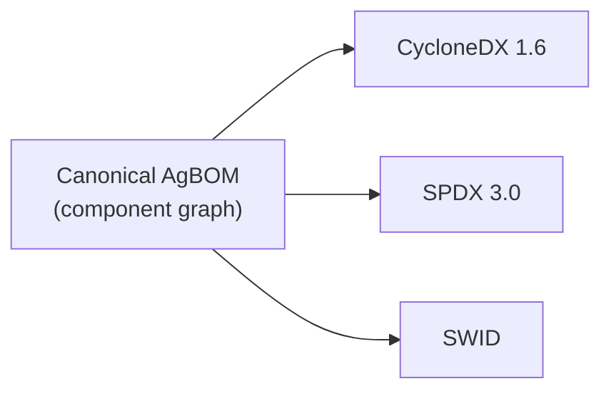

# Inspect — AgBOM

AI agents add and remove capabilities at runtime: a model swap mid-session, a hot-loaded MCP server, a new A2A peer, a knowledge source registered after `sessionStart`. Without inspectability, every Guardian policy that depends on what the agent *is* (rather than only what it *does*) becomes unverifiable.

The **Agent Bill of Materials (AgBOM)** is a queryable, dynamic inventory of the components an Observed Agent uses: Models, MCP servers, A2A peers, Tools, Knowledge sources, Memory stores, and Agent capabilities.

!!! info "AgBOM extends industry standards"
    ACS doesn't introduce a new BOM format. The canonical AgBOM is a structured component graph; CycloneDX, SPDX, and SWID outputs are deterministic derivations of the same graph.

AgBOM emission is the subject of the **ACS-Inspect** [conformance profile](../conformance.md#acs-inspect). When Guardian policy depends on component inventory (e.g. banning a model or tool at the boundary), the deployment MUST implement ACS-Inspect.

## Wire methods

The `agbom/*` namespace is reserved by [Specification §3](../instrument/specification.md#3-wire-format). Two methods are defined in v0.1.0:

| Method | Direction | Trigger |
|---|---|---|
| `agbom/snapshot` | Observed → Guardian | Once after `sessionStart`, before any content-bearing hook; and after any handshake renegotiation. Carries the full AgBOM. |
| `agbom/changed` | Observed → Guardian | Whenever a component is added, removed, or version-changed mid-session. Carries either a full snapshot or a diff (`added[]`, `removed[]`, `changed[]`). |

Both methods follow the standard ACS request envelope and are written into the SessionContext audit chain — AgBOM mutation is part of the security-relevant history of the session. Decisions are normally `allow`; Guardians MAY return `deny` to refuse a session whose component graph contains a banned component, or to block a hot-swap.

`agbom/changed` is part of the **ACS-Inspect-Dynamic** profile extension. Deployments that claim only **ACS-Inspect** emit a single snapshot and do not track mid-session mutations.

## Canonical schema

Every component graph is expressed in the canonical AgBOM document ([`agbom/document.json`](https://genai-security-project.github.io/agent-control-standard/schema/v0.1.0/agbom/document.json)). Components are typed; the type set in v0.1.0 is:

| Type | Required fields | Optional fields |
|---|---|---|
| `model` | `id`, `name`, `version`, `provider`, `endpoint` (URI), `context_window` | `args` (model-config snapshot) |
| `mcp_server` | `id`, `name`, `version`, `endpoint` (URI), `tools[]` | — |
| `a2a_peer` | `id`, `endpoint` (URI), `protocol_version` | `agent_card_ref` (URI to peer's Agent Card if known) |
| `tool` | `id`, `name`, `version`, `provider`, `capability` (abstract: `filesystem.delete`, `network.egress`, `process.execute`, …) | — |
| `knowledge_source` | `id`, `name`, `source_type` (`vector_db`/`search_index`/`knowledge_base`/`web_search`/`other`) | `endpoint` (URI), `schema_ref` (URI) |
| `memory_store` | `id`, `name`, `scope` (`session`/`user`/`tenant`/`global`), `store_type` | `path` (URI), `window_size` |
| `agent_capability` | `id`, `name`, `description` | `tools[]`, `mcp_servers[]`, `a2a_peers[]` |
| `skill` | `id`, `name`, `description`, `definition` (`ref`, `digest`) | `declared_capabilities[]`, `tools[]`, `mcp_servers[]`, `a2a_peers[]`, `models[]`, `composed_skills[]` |

The full per-component schema is [`agbom/component.json`](https://genai-security-project.github.io/agent-control-standard/schema/v0.1.0/agbom/component.json).

Every component SHOULD carry `registration_provenance` (who declared it — framework / configuration / runtime discovery) so AgBOM mutations are traceable in the same lineage system as data flow. Deployments claiming **ACS-Provenance** MUST populate `registration_provenance` on every component.

## Output format mappings

The canonical document is the source of truth; serialized output is a deterministic derivation. The mapping rules live in [`inspect/format-mapping.json`](https://genai-security-project.github.io/agent-control-standard/schema/v0.1.0/inspect/format-mapping.json).

The diagram below shows the canonical AgBOM deriving into three serialization formats. The derivation runs one way, from the canonical graph outward.

| Standard | ACS extension | Status |
|---|---|---|
| [CycloneDX 1.6](https://cyclonedx.org/) | [Extending CycloneDX](./extend_cyclonedx.md) | Working draft |
| [SPDX 3.0](https://spdx.dev/) | [Extending SPDX](./extend_spdx.md) | Working draft |
| [SWID](https://csrc.nist.gov/Projects/Software-Identification-SWID) | [Extending SWID](./extend_swid.md) | Working draft |

A Guardian MAY request a specific serialization in the handshake's AgBOM negotiation (`agbom_serializations_supported` in ServerHello); the canonical form is always the source of truth and the serializations are derivations.

## ACS-Inspect conformance bar

A deployment claiming **ACS-Inspect** MUST:

1. Emit `agbom/snapshot` once per session, before content-bearing hooks fire.
2. Have the Guardian accept `agbom/snapshot`, write it into the SessionContext audit chain, and serialize the canonical AgBOM into at least one of {CycloneDX 1.6, SPDX 3.0, SWID} on request.

A deployment claiming **ACS-Inspect-Dynamic** additionally MUST:

3. Emit `agbom/changed` on every mutation to the component graph.
4. Write those mutations into the audit chain.

Without -Dynamic, a deployment that hot-swaps components silently is not Inspect-conformant for that session — the Guardian's view of the agent diverges from runtime reality.

## Triggers for AgBOM updates

- Model added, removed, or version-changed.
- MCP server discovered, removed, or version-changed.
- A2A peer registered or deregistered.
- Tool registered, removed, or capability-changed.
- Knowledge source connected or disconnected.
- Memory store attached or detached.
- Agent capability declared or revoked.
