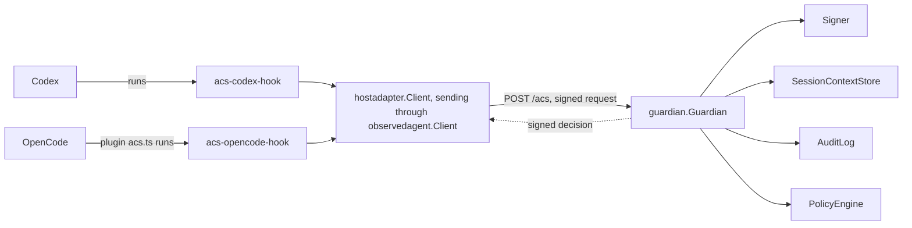
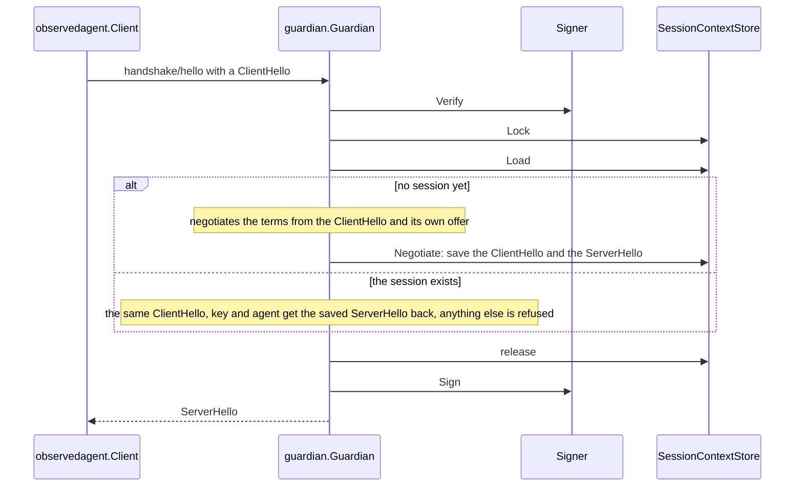
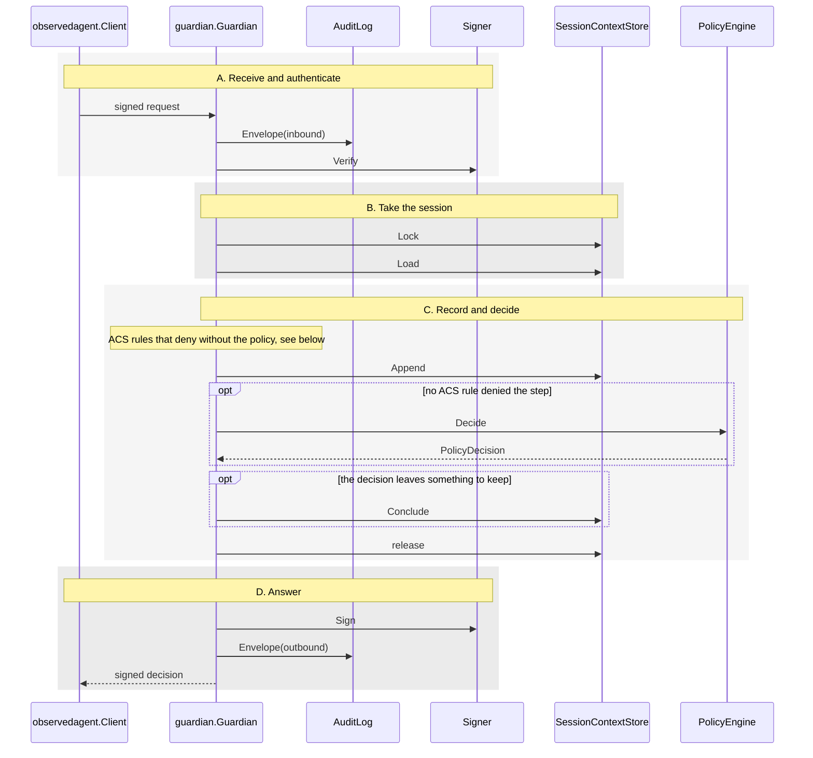
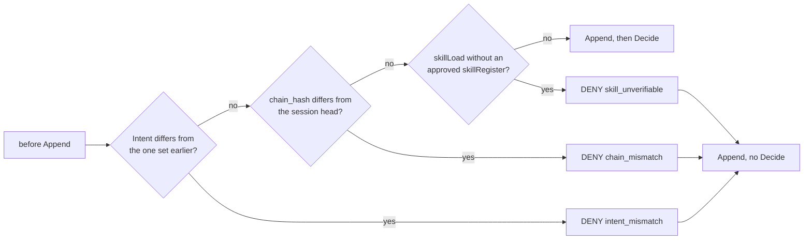
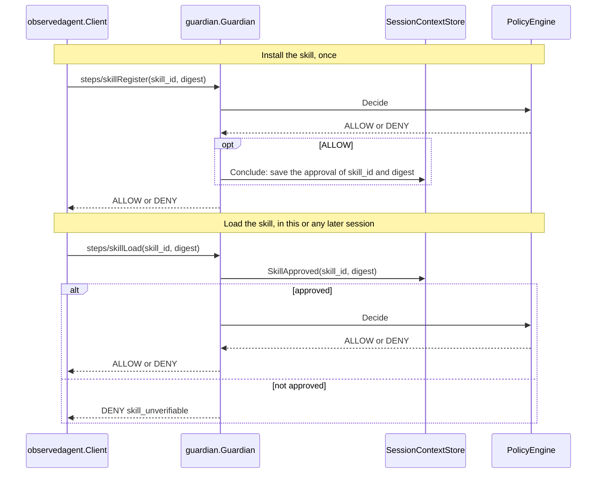
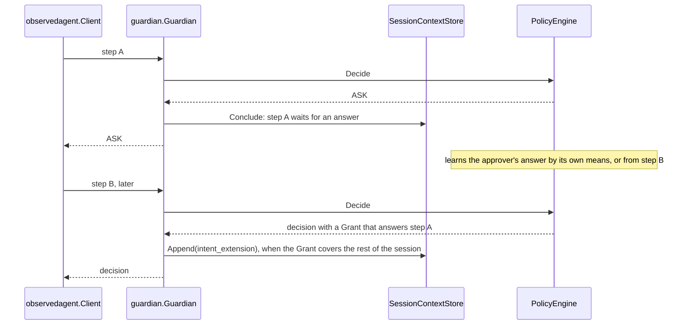
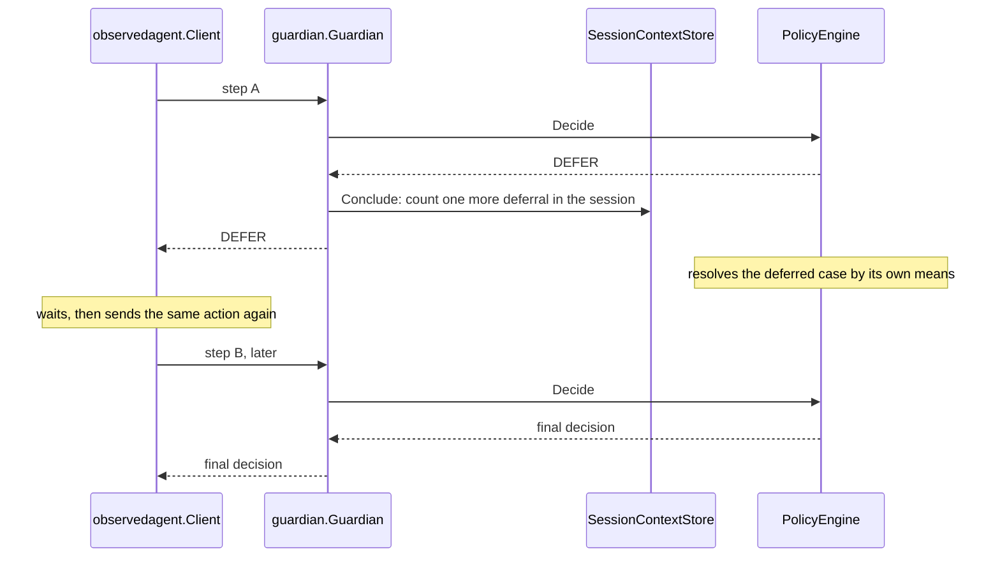

# Architecture

## What the Guardian is made of

The Guardian is the core. It implements the ACS rules: the handshake, signature
checks, replay protection, session ordering, the hash chain, the nineteen hooks
and wrapped MCP. Everything ACS leaves open sits behind four
interfaces, which are also the extension points.

Solid arrows are calls. The dashed arrow is the signed decision coming back.

### The four interfaces

| Interface | Declared in | What ACS leaves open | Implementation in this module |
| --- | --- | --- | --- |
| `PolicyEngine` | [`guardian/policy_engine.go`](../guardian/policy_engine.go) | The policy decision (§12.1). | `agtbridge.Engine`, running AGT's Rego policies |
| `Signer` | [`guardian/signer.go`](../guardian/signer.go) | Keys and signatures (§10). | `guardian.HMACSigner`, HMAC-SHA256 |
| `SessionContextStore` | [`guardian/session_context_store.go`](../guardian/session_context_store.go) | Where session state and its hash chain live (§8). | `guardian.MemorySessionContextStore`, bounded and in memory |
| `AuditLog` | [`guardian/audit_log.go`](../guardian/audit_log.go) | Where the audit records go. | `guardian.JSONLAuditLog`, JSONL files |

Your own implementation can replace any of them without changing the core. The Guardian
package does not depend on AGT: `agtbridge` is the engine the standalone command
plugs in. [Extend the Guardian](extending.md) lists what your own implementation of each interface must do.

### How AGT is used

AGT ships its policy runtime for Node, Python, .NET and Rust, but not for Go;
its separate general-purpose Go SDK does not expose this runtime.
The TypeScript reference reaches it through AGT's Node package, whose Rust
runtime calls the OPA command-line program. The Go Guardian runs the same
checked-in AGT Rego policies, unchanged, with OPA's Go library in process.

`agtbridge` implements the part of AGT's runtime that the checked-in manifest
uses. It loads the manifest, builds the policy input, runs the `egress`
annotation, converts verdicts and keeps policy state. On the recorded sessions
it decides as AGT does. A manifest that needs a feature outside
that part, such as Cedar policies or `extends`, stops startup with a message
that names it. [Differences](differences.md#agt) lists the boundary.

## How a request moves through the Guardian

Every participant and call on these diagrams is a type or method in this module.

### The store calls on these diagrams

| Call | Why |
| --- | --- |
| `Lock` | Only one step of a session runs at a time, across every Guardian sharing the store, until `release`. |
| `Load` | Reads the session while it is locked, so it cannot change underneath. |
| `Negotiate` | Saves a new session's handshake terms. |
| `Append` | Records the step in the chain before it is decided, and rejects a repeated request. |
| `SkillApproved` | Tells whether a skill with this digest was approved at registration. |
| `Conclude` | Keeps what the decision leaves for later steps. Skipped when there is nothing to keep. |

### The handshake

Every session starts with `handshake/hello`. The PolicyEngine is not asked.

### One step, in order

Every step takes the same path, in four stages.

### ACS rules that deny without the policy

Three more steps get their own handling: `steps/sessionEnd` closes the session, a
`steps/postCompact` summary has its lineage checked, and a `protocols/MCP/*` message is
checked by the MCP handler.

### The skill scenario

### The ASK scenario

ACS v0.1.0 defines no wire method for the approver's answer (#175).

### The DEFER scenario

ACS v0.1.0 defines no way to tell the Observed Agent that a DEFER is resolved (#14), so the
Observed Agent sends the action again. An engine that has not resolved the case answers DEFER again. A
session gets at most `MaxDeferrals` DEFER answers, 3 by default; the next one is DENY
`deferral_bound_exceeded`.

### Calls by method

| Method | `AuditLog` | `Signer` | `SessionContextStore` | `PolicyEngine` |
| --- | --- | --- | --- | --- |
| `handshake/hello` | both envelopes | `Verify`, `Sign` | `Lock`, `Load`, `Negotiate`; `Reserve` for a repeated handshake | `Policy()` only, read once at `guardian.New` |
| a native hook, `protocols/MCP/*` | both envelopes, events | `Verify`, `Sign` | `Lock`, `Load`, `Append`; `Reserve` after sessionEnd; `Conclude`, `SkillApproved` as the step needs | `Decide` |
| `system/ping` | both envelopes | `Verify` and `Sign` only when the ping is signed | none | none |

- Sessions run in parallel. No interface calls another, and none calls the Guardian.
- The store keeps the negotiated `ServerHello`.
  - Every replica uses it for the session's timeout, timestamp window, negotiated methods,
    version and approver types.
  - A replica with a different configuration applies it to new sessions only.
- Once a step is authenticated and names a negotiated method, every store, engine and
  internal failure is answered with a signed DENY.
  - An error would leave the Observed Agent to its failure posture, which proceeds by
    default.
  - The failure's detail goes to the `AuditLog` as a `failure` event; the wire carries a
    fixed message.
  - If the `Signer` itself cannot sign, the Guardian can only return an unsigned internal
    error.

## Read the code in this order

1. **Types and interfaces.** [`acs/`](../acs/) holds the ACS wire types: envelopes,
   the handshake, decisions, hook payloads and SessionContext objects. The four
   interface files are in [the table above](#the-four-interfaces).
2. **The built-in implementations.**
   [`guardian/hmac_signer.go`](../guardian/hmac_signer.go) signs the canonical form
   built in [`internal/jcs/`](../internal/jcs/) and
   [`internal/envelope/`](../internal/envelope/); [canonical form](canonical-form.md)
   explains the bytes.
   [`guardian/memory_session_context_store.go`](../guardian/memory_session_context_store.go)
   keeps sessions and the hash chain from [`internal/chain/`](../internal/chain/), and
   [`guardian/guardiantest/`](../guardian/guardiantest/) is the test suite any store
   must pass. [`guardian/jsonl_audit_log.go`](../guardian/jsonl_audit_log.go) writes
   audit records.
3. **The core.** `Guardian.answer` in [`guardian/guardian.go`](../guardian/guardian.go)
   validates, authenticates and routes each request. `handshake` and `step` in
   [`guardian/step.go`](../guardian/step.go) take it to a signed answer;
   [one step, in order](#one-step-in-order) draws the same path.
   The helpers: [`internal/schema/`](../internal/schema/) validates against the
   specification's schemas, [`internal/handshake/`](../internal/handshake/) negotiates
   the session, [`internal/method/`](../internal/method/) routes the nineteen hooks,
   [`internal/disposition/`](../internal/disposition/) checks each decision and
   [`internal/mcp/`](../internal/mcp/) reads wrapped MCP messages.
   [`cmd/guardian/`](../cmd/guardian/) is the standalone program around the core.
4. **The AGT engine.** [`agtbridge/`](../agtbridge/), described in
   [how AGT is used](#how-agt-is-used).
5. **The Observed Agent side.** [`internal/observedagent/`](../internal/observedagent/) is the
   bundled Observed Agent client: it signs requests and checks answers, and the
   tests drive the Guardian through it.
   [`internal/hostadapter/`](../internal/hostadapter/) builds a host integration on
   it, and [`examples/codex/`](../examples/codex/) and
   [`examples/opencode/`](../examples/opencode/) are the two host adapters.
   [`examples/custom-engine/`](../examples/custom-engine/) implements all four
   interfaces without AGT.
